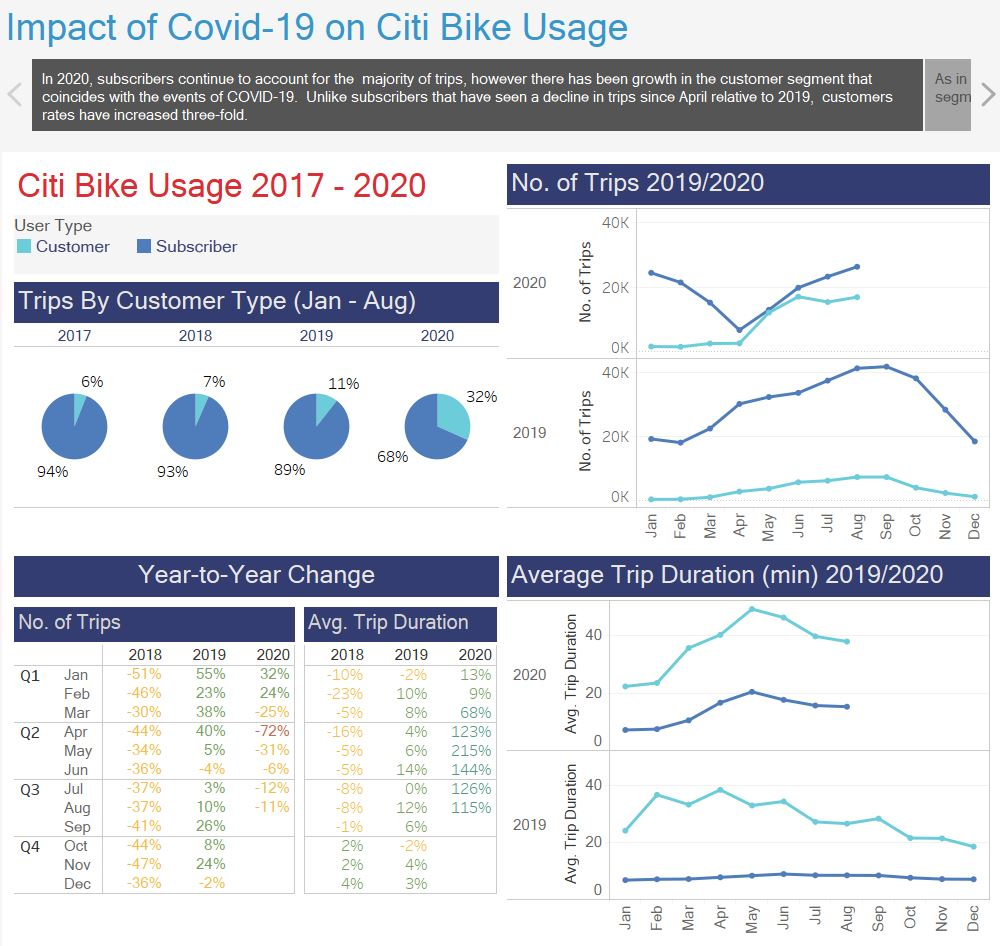
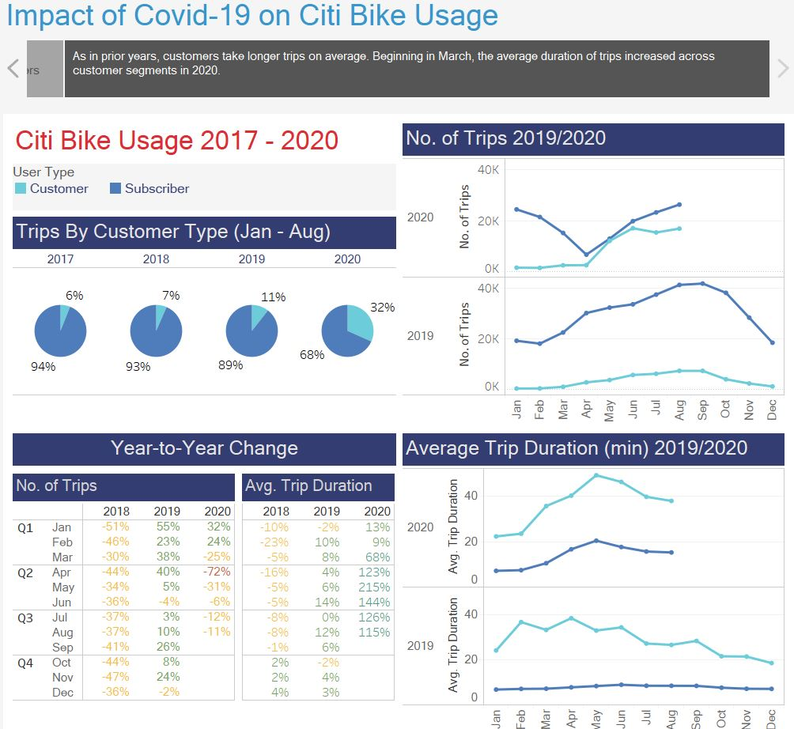
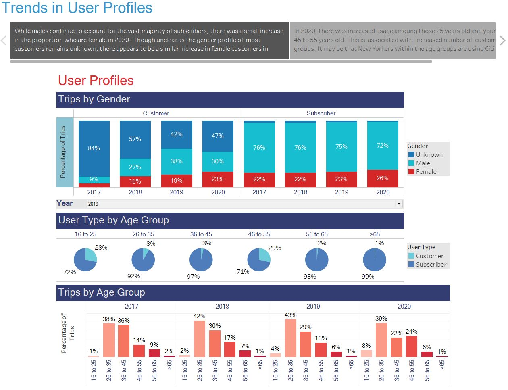
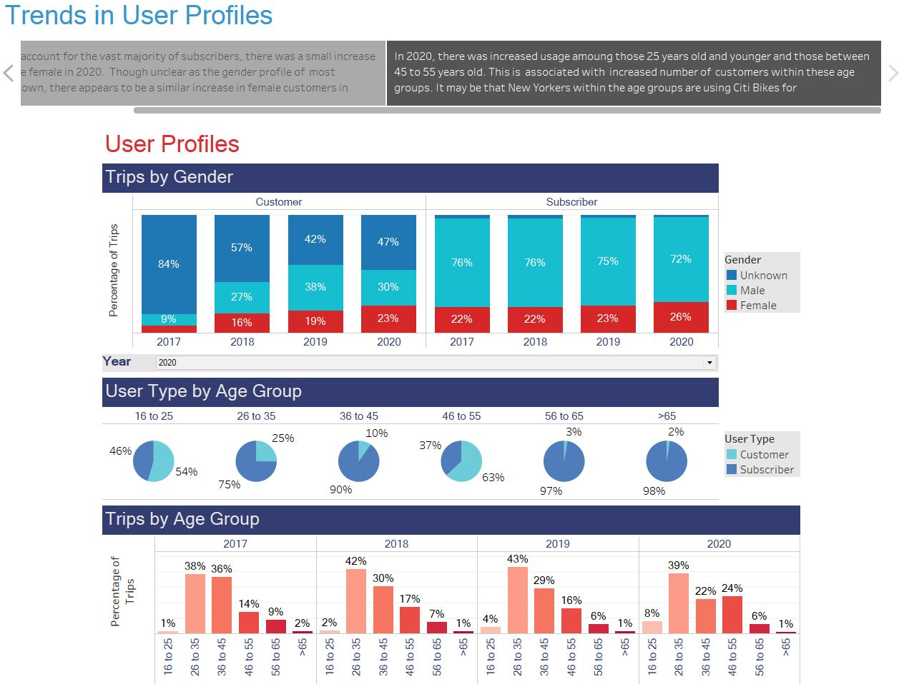
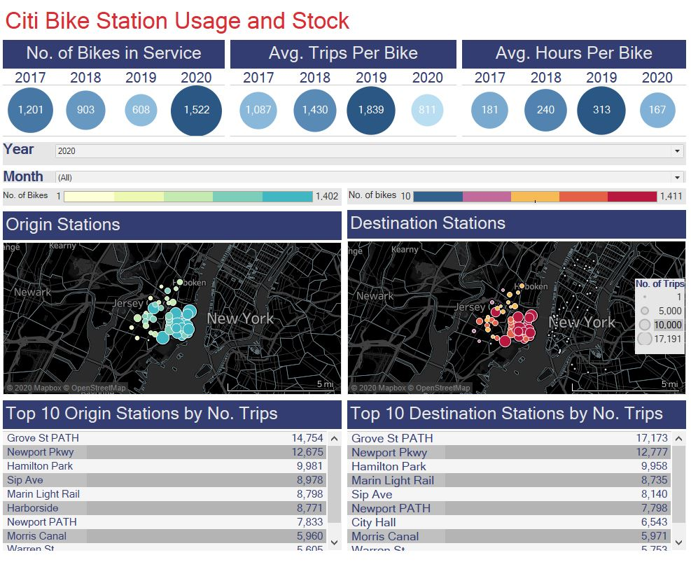

# Citi Bike Analytics

# Background

Since 2013, the Citi Bike Program in New York has implemented a robust infrastructure for collecting data on the program's utilization. Each month bike data is collected, organized, and made public on the Citi Bike Data webpage.

I analyzed the data of the Citi Bike service from 2017 to 2020 to examine the impact of COVID-19 on the usage and profiles of customers.

# Approach

* Merged [monthly data](https://www.citibikenyc.com/system-data) from 2017 to 2020. 

* Visualized the usage and profile data in Tableau. [Deployed here](https://public.tableau.com/profile/megan.mcglashan#!/vizhome/CitiBikeAnalysis_16029550768170/Covid-19ImpactonUsage).

# Findings 

## Impact of COVID-19 on usage

In 2020, subscribers continue to account for the  majority of trips, however there has been growth in the customer segment that coincides with the events of COVID-19.  Unlike subscribers that have seen a decline in trips since March relative to 2019,  customers rates have increased three-fold. 

As in prior years, customers take longer trips on average. Beginning in March, the average duration of trips increased across customer segments in 2020. 

)

## Consumer Trends

While males continue to account for the vast majority of subscribers, there was a small increase in the proportion who are female in 2020.  Though unclear as the gender profile of  most customers remains unknown, there appears to be a similar increase in female customers in 2020. 

)

In 2020, there was increased usage amoung those 25 years old and younger and those between 45 to 55 years old. This is  associated with  increased number of  customers within these age groups. It may be that New Yorkers within the age groups are using Citi Bikes for transportation in 2020. 

)

## Station Usage

Despite more bikes available than in prior years, the 2020 stock has seen the lowest average use. 

Generally, the most common stations for the start of trips, which are located in Manhattan, are also the top stations to end trips. Unlike origin stations, users's destinations stations also occasionally include other boroughs.  

